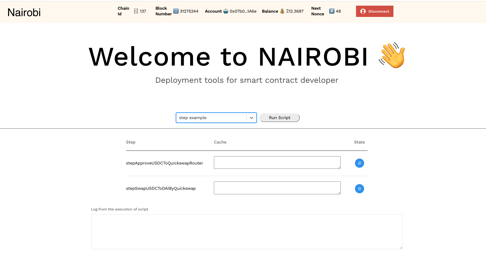

# Nairobi

Nairobi is a deployment tool that sets up and deploys contracts without exposing private keys. Smart contract deployers can execute deployment easier and safer by writing scripts.

## Features

- Support metamask (mean support hardware wallet)
- Support gnosis-safe
- Provide step flow system to execute the scripts
- Write the script by using Ether.js
- Basically support EVM-Based Chains

## Example ([Demo](https://github.com/ksin751119/Nairobi) on Polygon)

- setp example: show the step flow system how to work

  1. approve USDC to Quickswap router
  2. swap USDC to quickswap

- failed example: show how to pass the step has been executed
- gnosis example: show how to interact with gnosis

