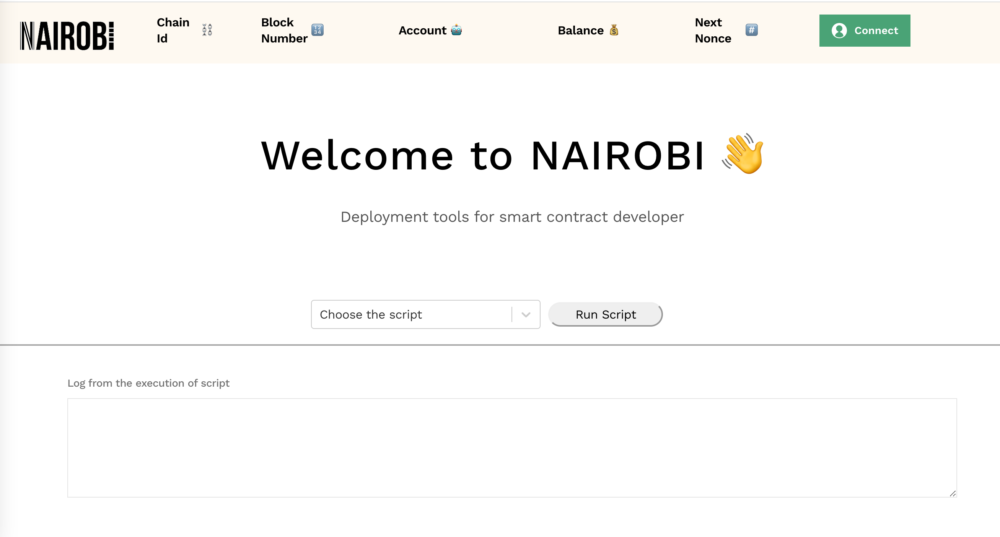

# Nairobi

Nairobi is a deployment tool(or framework) that sets up and deploys contracts without exposing private keys. Smart contract deployers can execute deployment easier and safer by writing scripts.

## Main Features

- Support `Metamask` (means support hardware wallet)
- Support `gnosis-safe`
- Provide step flow system to execute the scripts
- Write the script by using `Ether.js`
- Basically support EVM-Based Chains

## How to integration your script

1. write your scripts into `src/scripts/` folder
2. add to `default.ts`
3. execute command `yarn start`
4. select your script and run

## Example ([Demo](https://youtu.be/qDpyWvYqlJY) on Polygon)

- `quickswap-steps-example`: show the step flow system how to work

  1. approve `USDC` to `QuickSwap` router
  2. swap `USDC` to `DAI` through `QuickSwap`

- `gnosis-safe-example-ethereum` : show how to interact with gnosis safe on ethereum
- `gnosis-safe-example-polygon` : show how to interact with gnosis safe on ethereum

## On the roadmap

- [ ] Trigger Gnosis Execution
- [ ] Verify Contract on Etherscan
- [ ] optimize layout
- [ ] Support Gnosis Safe TxBuilder

---

Welcome anyone to contribute any PR to improve Nairobi, to improve the development environment of web3. I am glad to see any project they help the entire web3 industry. If you have other similar projects, welcome to share them with me. Let more talented engineers join the web3 world and create many fantastic projects in the future.

---

